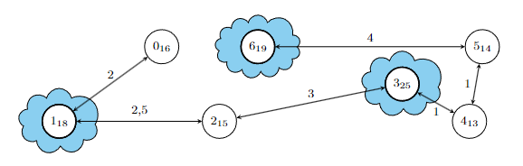

# ADA code tester

ADA code tester is a Java program made to test my implementation of an algorithm I had to code during my degree.
Some test cases of the algorithm take 5m+ and I wanted to be able to test my implementation in all the test cases in an easy maner.

For that reason, I made this program which runs the test cases and verifies that the output matches what is expected.

The algorithm was described as:

> A cloud storage company uses $n$ servers (nodes) connected by a private bus. Only $m$ nodes can act as "gateways" to the outside. Each node has a storage capacity $c_i$, and the nearest gateway is assigned to nodes without direct external connectivity. The goal is to select the $m$ gateway nodes that minimize the estimated traffic, defined as $\sum_{i=1}^{n} c_i \cdot d_{ij}$, where $d_{ij}$ is the distance to the associated gateway node.
> For example, with $n = 7$ nodes and $m = 3$ gateways, selecting nodes $1$, $4$, and $6$ can result in lower estimated traffic compared to other combinations.
> 

This repository has 2 implementations of the algorithm: `algo/v8` and `algo/v9`. To try their respective test suites, run `make run.8` or `make run.9`. Additionally, the `N` enviroment variable can change how many tests run at the same time while `T` specifies the time limit in secconds each test case has to run.

### Requirements

- GNU Make 4.3
- gcc 11.4.0
- Apache Maven 3.8.2
- Java 21
